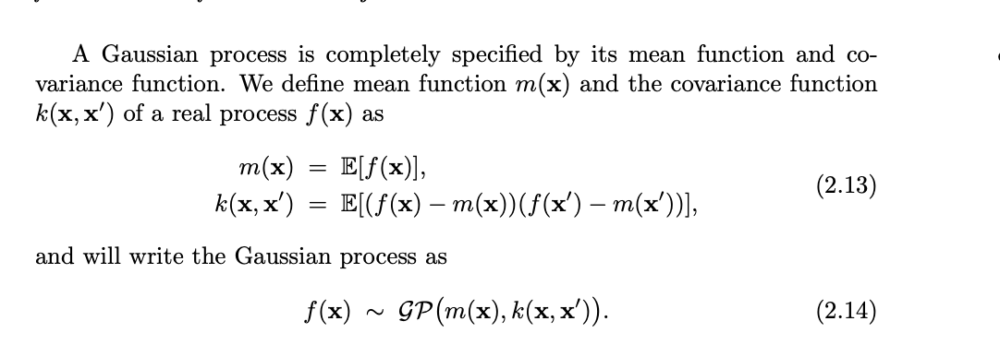

# GaussianProcessProject

This project aims to explore the applications of the Gaussian Process (GP). The learning outcomes of this project are to understand the defining equations of a GP, how a GP can be used in a larger baysian optimization workflow, and and what are the key components of utilizing this machine learning model. 

Defining Equations:

A gaussian process can be defined by calculating the mean function and the covariance function of the data we are modeling. A graph of this is shown in 'Gaussian Process' Jupyter Notebook File. A formalization of this can be shown as 

source: http://www.gaussianprocess.org/gpml/chapters/RW2.pdf

Key Components:

Application Overview:

    Baysian Optimization:
    
    

