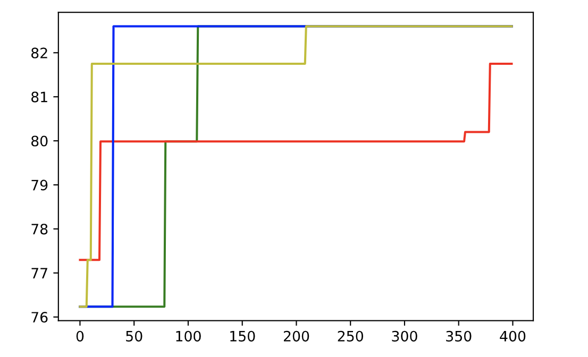

# GaussianProcessProject

This project aims to explore the applications of the Gaussian Process (GP). The learning outcomes of this project are to understand the defining equations of a GP, how a GP can be used in a larger baysian optimization workflow, and and what are the key components of utilizing this machine learning model. 

## Defining Equations:

A gaussian process regression can be defined by calculating the mean function and the covariance function of the data we are modeling. A graph of this is shown in  [Gaussian Process Jupyter Notebook File](https://github.com/evanpcosta/GaussianProcessProject/blob/main/Gaussianprocess.ipynb). A formalization of this can be shown as 


            source: http://www.gaussianprocess.org/gpml/chapters/RW2.pdf
            

## Key Components:
To train a Gaussian Process you need the following components:
* Cost Function: Negative Log Likelihood (in this case)
* Optimization Method: Gradient Descent (in this case)
* Kernel Method: RBF (in this case)

The equation for Negative Log Likelihood is:


The RBF Kernel looks like:


And gradient descent has an implementation similar to that of Machine Learning Refined Github
```
def gradient_descent(X, Y, g, alpha, max_its, sigma, l):
    noise = 1.0
    gradient = grad(g, argnum=[0, 1, 2])
    cost_history = np.zeros(max_its)
    for iteration in range(max_its):
        cost_history[iteration] = g(X, Y, sigma, l, noise)
        del_sigma, del_l, del_noise = gradient(X, Y, sigma, l, noise)
        sigma = sigma - alpha*del_sigma
        l = l - alpha*del_l
        noise = noise - alpha*del_noise
    return cost_history, l, sigma, noise
```
                       Adapted from: https://github.com/jermwatt/machine_learning_refined and 
                       https://nipunbatra.github.io/blog/ml/2020/03/29/param-learning.html

Specifically the way a GP workflow is optimizaed over a dataset involves these key steps again outlined in the [Gaussian Process Jupyter Notebook](https://github.com/evanpcosta/GaussianProcessProject/blob/main/Gaussianprocess.ipynb)

1. Define Kernel, Cost Function (Negative Log Likelihood), Optimization method (Gradient Descent)
2. Calculate the "posterior" over the given dataset, where you are calculating the mean and covariance function, as preliminary values.
3. Optimize the hyper parameters with optimization method
            

                       L - horizontal smoothening factor
                       Sigma_y - noise
                       Sigma_f -vertical deviation factor

4. Recalculate the posterior (mean covariance functions for dataset) with optimized values
5. Return optimizaed gaussian process regression
Application Overview:

The application portion of this project was done using a multivariate data set about concrete compressive strengths. First I split the data set into training and quering portions, where the quering portions where unlabeled. Then by training a gaussian process on the data and using the mean and covariance functions I was able to calculate depending on the querying function I was able to choose the best sample to label from the unlabeled data set. Doing this iteritively and training the model after each given set of iterations, we can optimally search an N-dimensional space. Using this workflow we can further abstract a model that query mutivariate parameters to create an optimized concrete sample over a global search space. Theoretically allowing us to make stronger and stronger concrete. 

This workflow of iteratively training a gaussian process, querying data, and retraining the GP on newly labeled data to optimally search is called bayesian optimization. 

Something to help visualize the workflow:

            
          
    
    
All of this is completed in the [Active Learning 1 Jupyter Notebook](https://github.com/evanpcosta/GaussianProcessProject/blob/main/Activelearning1.ipynb) where I preprocess the data set and complete thi iteretive workflow to search for the samples with the best concrete compressive strength. 

Once the workflow was finished running I plotted the highest compressive strength labels found for each querying method over iterations. 

   

The X-axis is iterations, and the Y axis is compressive strength. Blue line is uncertainty querying function, red line is greedy sampling, yellow line is MCAL sampling, and the green line is random sampling. We can see in the graph that all the strategies except for greedy search performed better than random sampling through the local search space. This graph can be found at the bottom of the [Active Learning 1 Jupyter Notebook](https://github.com/evanpcosta/GaussianProcessProject/blob/main/Activelearning1.ipynb) The definitions and inner workings of the query strategies are beyond the scope of this project. 


